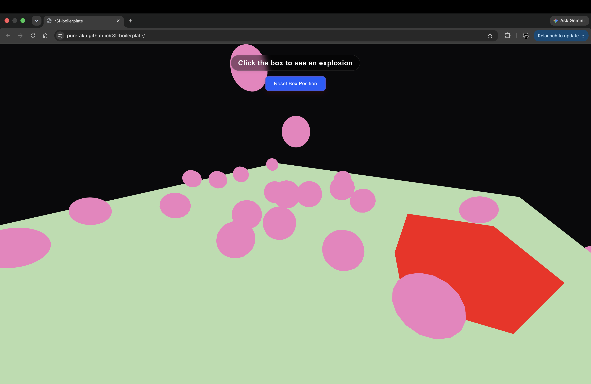

# r3f-boilerplate

just a basic r3f boilerplate with physics integration



## Run
```
npm i && npm run dev
```

>ps: this is related to my threejs-boilerplate repo but uses r3f rather than vanilla threejs
